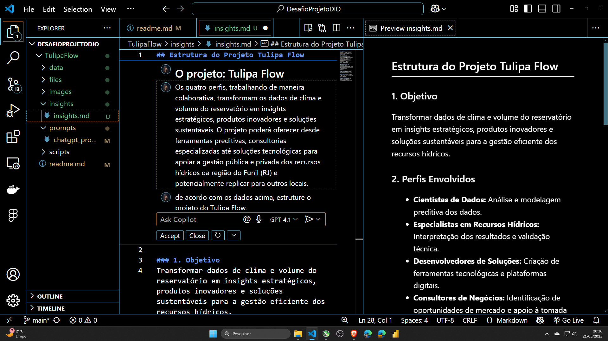

# Prompt com ChatGPT

Acesse a [interação completa](https://chatgpt.com/share/682e6015-e874-8007-ade1-47dd6c79acd0) no próprio link gerado pelo ChatGPT.

### Minha interação com o ChatGPT pode ser resumida em três pontos principais:

1. Fluidez - A comunicação foi natural e intuitiva.

2. Satisfação - O atendimento superou minhas expectativas iniciais.

3. Produtividade parcial - Por usar a versão gratuita, não consegui concluir toda a análise em um único dia, embora soubesse que poderia enriquecê-la com mais interações posteriormente.

Contudo, optei por finalizar o projeto agora porque o Copilot no VSCode atendeu plenamente às minhas necessidades ao analisar o parágrafo de síntese gerado pelo ChatGPT (como mostra a imagem abaix

