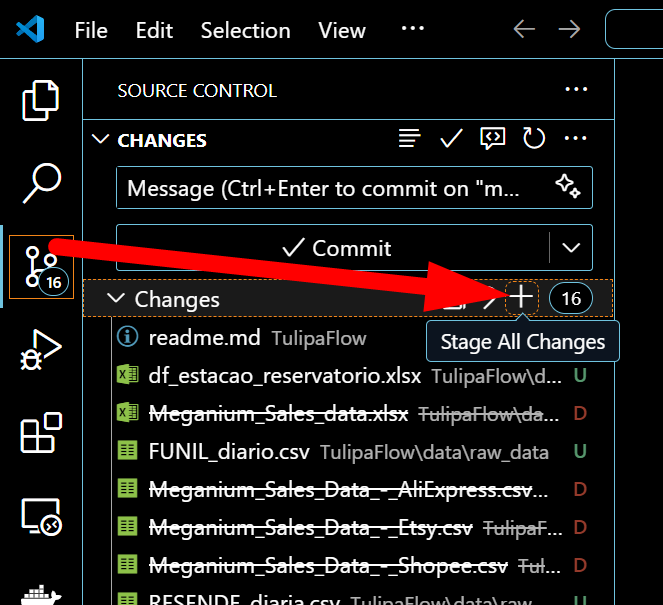
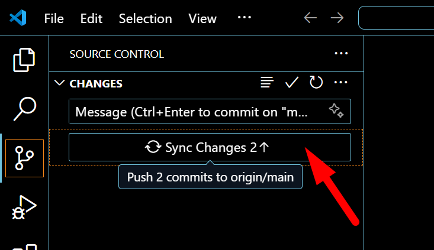
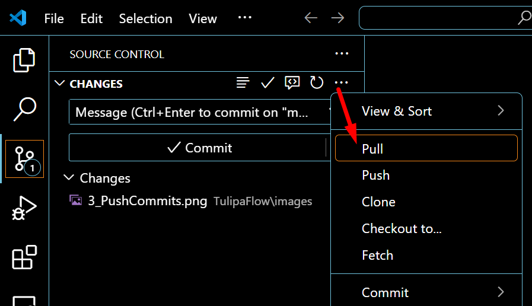

# Scripts

**Fluxo de trabalho utilizado:**

1. **Atualização inicial**: Realizei as primeiras modificações diretamente no arquivo `readme.md` através da interface do GitHub.

2. **Trabalho local**: 
   - Clonei o repositório utilizando o comando:
     ```bash
     git clone [URL do repositório]
     ```
   - Para edições subsequentes, aproveitei os recursos de ícones e a interface intuitiva do VS Code, que se mostraram mais eficientes.


## Observação:

Utilizei apenas o comando `git clone` via terminal - todas as demais operações foram realizadas por meio da interface gráfica do VS Code, conforme demonstrado nas imagens abaixo.

1. Stage All Changes



---

2. Commit


---

3. Push


---

Depois que ocorreram novas atualizações no arquivo que eu havia clonado no meu computador, antes de recomeçar pela etapa 1 mencionada acima, precisei realizar a etapa da imagem abaixo. Isso porque eu havia feito uma atualização diretamente no GitHub, fazendo com que a versão de lá ficasse diferente da minha. Para evitar conflitos, realizei um pull das alterações.

0. Pull
